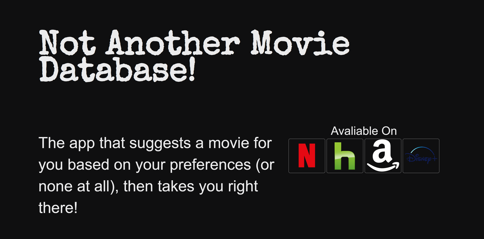

# Not Another Movie Database!

An app that lets the user select a series of filters to randomly select a suggested movie on whatever streaming services they may have. These filters include: Genre, Streaming Services these titles are on, release year, actors, and directors. The movie is randomly presented on a spinning wheel like its a game-show.

[Deployed Here](https://chrscchrn.github.io/NotAnotherMovieDb/)

## User Story
As an indecisive movie lover, I want to not spend the length of a movie choosing which movie to watch so that I can watch more movies. 
The motivation for development is we consistently spend the average length of a movie picking which movie to watch.

## Usage
To demo this application go to the deployed site and select preferences

## Starting the app locally
```
npm install
```


## Technology Used

- HTML
- CSS
- JavaScript

### APIs
- Utelly
- The Movie Db

Github & Email
```
https://github.com/chrscchrn
cochranschris@gmail.com
```

## Screenshot
